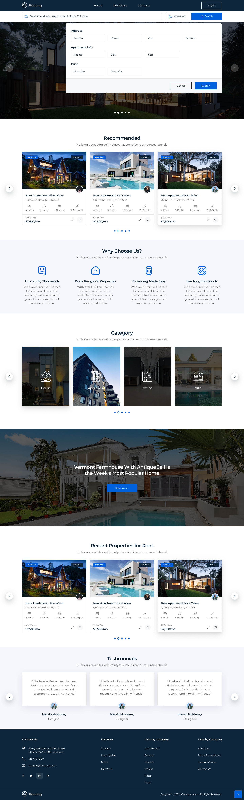

# 🏡 Houzing – Real Estate Web App (Angular + ZarDUI)

Houzing is a real estate property listing web application built with **Angular CLI** and **ZarDUI** for UI components.  
The app provides property search, advanced filtering, categories, testimonials, and detailed property views with a modern, responsive UI.  

---

## 🎨 UI Preview



---

## ✨ Features

- 🔍 **Advanced Search & Filtering** – Search properties by address, city, region, rooms, size, price range, etc.  
- 🏠 **Property Listings** – Recommended properties, popular homes, and recent listings.  
- 📂 **Property Categories** – Browse by **House, Apartment, Office, Villa** and more.  
- 🧾 **Property Details** – Each listing includes images, pricing, features, and agent info.  
- 🛡️ **Why Choose Us Section** – Highlights trust, financing, and neighborhoods.  
- 💬 **Testimonials** – Customer reviews and feedback.  
- 📱 **Responsive Design** – Powered by ZarDUI’s adaptive components.  

---

## 🛠 Tech Stack

- **Frontend Framework**: [Angular](https://angular.io/) (latest version)  
- **UI Library**: [ZarDUI](https://zardui.com)  
- **Styling**: SCSS + ZarDUI theming system  
- **Routing**: Angular Router  
- **State Management**: RxJS & Services (NgRx optional for complex flows)  
- **Build Tool**: Angular CLI  
- **Linting & Formatting**: ESLint + Prettier  

---

## 🚀 Getting Started

### Prerequisites
- [Node.js](https://nodejs.org/) >= 18.x  
- [Angular CLI](https://angular.io/cli) >= 17.x  
- npm or yarn  

### Installation
```bash
# Clone repository
git clone https://github.com/your-username/houzing-angular.git
cd houzing-angular

# Install dependencies
npm install
```

### Install ZarDUI
```
npm install zardui
```

### Import ZarDUI in your main module:
```
import { ZarduiModule } from 'zardui';

@NgModule({
  imports: [
    BrowserModule,
    ZarduiModule,
    ...
  ],
  bootstrap: [AppComponent]
})
export class AppModule {}
```

## 📂 Project Structure
```
houzing-angular/
│── src/
│   ├── app/
│   │   ├── core/              # Core services, interceptors, guards
│   │   ├── shared/            # Shared components, directives, pipes
│   │   ├── features/          # Feature modules (properties, search, auth, etc.)
│   │   ├── layouts/           # Layout components (header, footer, sidebar)
│   │   ├── app-routing.module.ts
│   │   ├── app.module.ts
│   ├── assets/                # Images, fonts, icons
│   ├── environments/          # Environment configs
│── angular.json
│── package.json
│── README.md

```

## ⚙️ Environment Configuration
Create environment files in src/environments/:

environment.ts
```
export const environment = {
  production: false,
  apiUrl: 'http://localhost:3000/api'
};
```
environment.prod.ts
```
export const environment = {
  production: true,
  apiUrl: 'https://api.houzing.com'
};
```

## 📦 Build
```
ng build --configuration production
```
Build artifacts will be stored in the dist/ directory.

## 🚢 Deployment
- Vercel / Netlify: Deploy dist/ folder directly.
- Docker (optional):
```
FROM node:18-alpine as build
WORKDIR /app
COPY package*.json ./
RUN npm install
COPY . .
RUN npm run build -- --configuration production

FROM nginx:alpine
COPY --from=build /app/dist/houzing-angular /usr/share/nginx/html
```

## 🧑‍💻 Coding Standards
- Use feature modules for scalability.
- Follow Angular + ZarDUI best practices.
- Strict typing with TypeScript.
- Use ESLint + Prettier for consistency.
- Use RxJS best practices (takeUntil, asyncPipe).
- Centralize ZarDUI theme customization under /shared/styles/.

## 🤝 Contribution
1. Fork the repo
2. Create a feature branch (git checkout -b feature/amazing-feature)
3. Commit changes (git commit -m "feat: add amazing feature")
4. Push to branch (git push origin feature/amazing-feature)
5. Open a Pull Request

## 📜 License
This project is licensed under the MIT License.